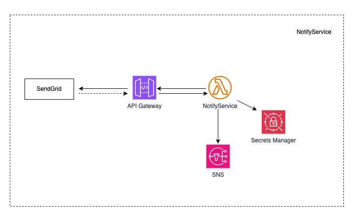

# Notify Service

A Notify Service designed to handle HTTP requests, publish messages to AWS SQS, consume those messages to send emails via SendGrid, and manage webhook notifications from SendGrid to publish events to AWS SNS.

## Features

- Receive HTTP requests to trigger email notifications.
- Publish messages to an AWS SQS queue.
- Consume messages from the AWS SQS queue and send emails via SendGrid.
- Receive webhook notifications from SendGrid for email events (e.g., delivery, bounce).
- Publish event data to AWS SNS for further processing.

